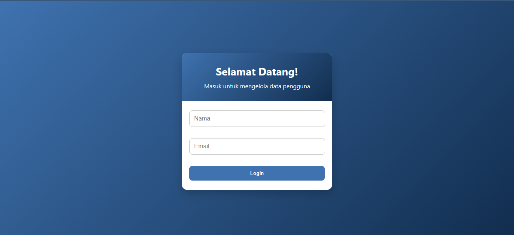
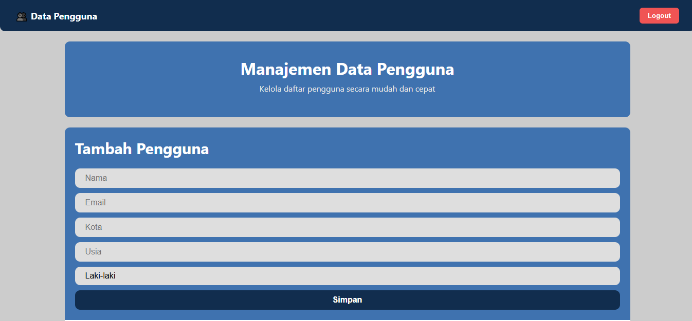
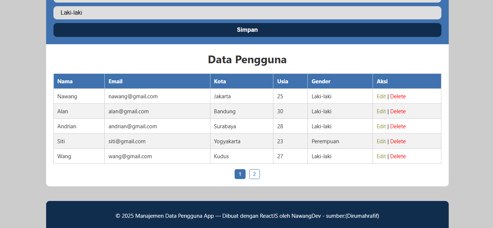

<p align="center">
  
</p>

<p align="center">
  <a href="https://reactjs.org/"></a>
  <a href="https://www.npmjs.com/package/axios"></a>
  <a href="#"></a>
</p>

# ReactJS User Management App

Aplikasi ini dibuat menggunakan **ReactJS** dan **Axios** untuk melakukan manajemen data pengguna.  
API backend yang digunakan untuk endpoint `/person` **sudah diuji menggunakan Postman** sehingga memastikan bahwa operasi GET, POST, PUT, dan DELETE bekerja dengan baik.

Fitur utama dari aplikasi ini meliputi:

- **Tambah Pengguna:** Menambahkan data pengguna baru (Nama, Email, Kota, Usia, Gender).
- **Edit Pengguna:** Mengubah data pengguna yang sudah ada.
- **Hapus Pengguna:** Menghapus data pengguna.
- **Tabel Data Pengguna:** Menampilkan data pengguna dalam format tabel.
- **Pagination:** Menampilkan maksimal 5 data per halaman dan membuat halaman baru jika data lebih dari 5.
- **Responsive:** Tampilan menyesuaikan ukuran layar perangkat.
- **Login Sederhana:** Membatasi akses ke aplikasi hanya untuk pengguna yang sudah login.

## Screenshot Aplikasi

Berikut contoh tampilan aplikasi:

<p align="center">
  
</p>

<p align="center">
  
</p>

<p align="center">
  
</p>

## Teknologi yang Digunakan

- **Frontend:** ReactJS (V18), Axios, CSS
- **Backend:** REST API (Node.js)
- **Database:** JSON
- **Version Control:** Git dan GitHub

## Link Deploy

Silahkan login dengan Username: admin & Email: admin@gmail.com

[🌐 Lihat Aplikasi di Vercel](https://react-user-management-flame.vercel.app/)

## Cara Menjalankan Aplikasi (Localhost)

1. Clone repository:

```bash
git clone https://github.com/nawangandrian/react-user-management.git
```

2. Install sebelum mulai:

```bash
npm install
npm install -g json-server
```
